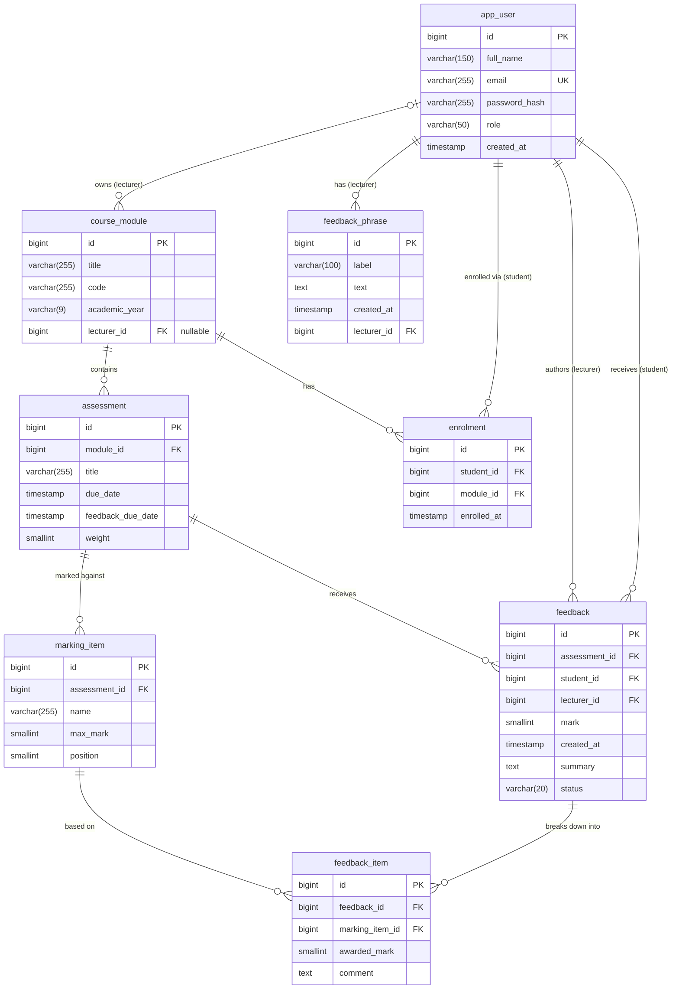
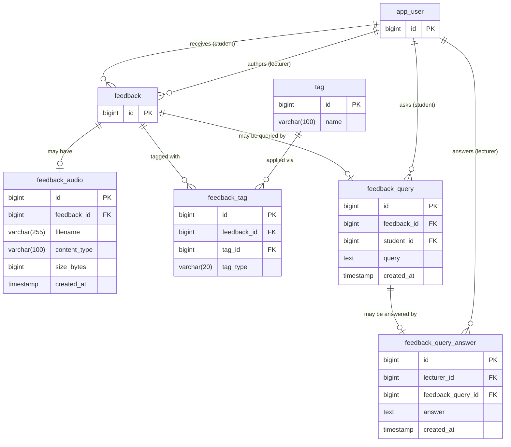

# Assessment Feedback Application

A web application for recording and receiving structured assessment feedback. Lecturers mark student work against a per-assessment rubric, attach written and audio comments, tag recurring themes, and publish feedback when ready. Students view their feedback, ask clarifying questions, and track how their marks and feedback themes change across academic years.

## Tech stack

**Backend** — Java 26, Spring Boot 4.1.0, Spring Security (JWT), Spring Data JPA, Flyway, PostgreSQL 16  
**Frontend** — React 19, Vite, Mantine, React Router  
**Infrastructure** — Docker Compose

Exact dependency versions are in `backend/pom.xml` and `frontend/package.json`.

## Installation

**Prerequisites:** Docker Desktop (or Docker Engine with Compose v2 or later)

```bash
git clone https://github.com/ChanGeR1-2/Assessment_Feedback_App.git
cd Assessment_Feedback_App
docker compose up --build
```

On startup, Postgres starts, waits for its healthcheck, the backend runs Flyway migrations and then seeds demo data, and the frontend serves on Vite.

## Using the App

Frontend is located at http://localhost:5173/, the backend is located at http://localhost:8080/, Postgres is exposed on port 5432 for database tooling (not browsable).

The database, as well as the docker volume holding audio recordings can be wiped and reset using

```bash
docker compose down -v
```

### Demo accounts

All accounts use the password `password123`.

| Email | Role | Notes |
|---|---|---|
| `admin@dissertation.com` | Admin | Manages users: currently limited in scope |
| `lecturer@dissertation.com` | Lecturer | Owns all modules; has marking in progress |
| `elena.marsh@dissertation.com` | Student | Three years of history — use for the progress view |
| `daniel.okafor@dissertation.com` | Student | Current year only |

Other students follow the same pattern (`firstname.lastname@dissertation.com`).

### Environment Variables

Docker Compose file serves development default environment variables:
- SPRING_PROFILES_ACTIVE: docker,dev
- SPRING_DATASOURCE_URL: jdbc:postgresql://db:5432/assessment_feedback
- SPRING_DATASOURCE_USERNAME: assessment_user
- SPRING_DATASOURCE_PASSWORD: assessment_password
- SPRING_JPA_HIBERNATE_DDL_AUTO: validate
- APP_JWT_SECRET: ${APP_JWT_SECRET:-dev-only-secret-change-me-at-least-32-bytes-long}
- APP_JWT_EXPIRATION_MS: 86400000
- APP_AUDIO_STORAGE_PATH: /app/data/audio
- VITE_API_BASE_URL: /api

APP_JWT_SECRET must be at least 32 characters long or the app won't start.

## API Documentation

Interactive documentation is generated from the code and available while the
application is running:

- **Swagger UI** — http://localhost:8080/swagger-ui/index.html
- **OpenAPI spec** — http://localhost:8080/v3/api-docs

To call protected endpoints from the UI, first `POST /api/auth/login` with
`{"email": "lecturer@dissertation.com", "password": "password123"}`, then paste
the returned token into the **Authorize** dialog. This allows endpoints to be called
as the lecturer role.

### Endpoint overview

| Area | Endpoints | Access |
|---|---|---|
| Auth | `POST /api/auth/login` | Public |
| Users | `GET/POST /api/users` | Collection: admin · Individual: authenticated |
| Enrolments | `/api/enrolments`, `/api/students/{studentId}/modules` | Write: admin · Read: authenticated |
| Modules | `GET /api/modules`, `POST /api/modules` | Read: authenticated · Write: admin |
| Assessments | `GET /api/assessments`, `/api/assessments/{id}`, `/api/assessments/stats` | Scoped by role |
| Marking scheme | `/api/assessments/{id}/marking-items` | Owning lecturer |
| Feedback | `POST /api/feedback`, `GET /api/feedback/{id}` | Lecturer writes · student reads own |
| Audio | `/api/feedback/{id}/audio` | Owning lecturer · recipient student |
| Queries | `/api/students/{studentId}/feedback-queries`, `/api/lecturer/feedback-queries`, `/api/feedback-queries/{id}/answer` | Student asks · lecturer answers |
| Tags | `GET /api/tags`, `/api/students/{id}/tag-summary`, `/api/lecturer/tag-summary`, `/api/students/{id}/tag-summary/per-year` | Vocabulary: authenticated · Summaries: own data only |
| Phrases | `/api/phrases` | Lecturer (own only) |

## Entity Relationship Diagrams

Two entity relationship diagrams have been made using Mermaid Live Editor. The first one shows the overall schema and the second shows the omitted extensions of the feedback entity (split up to improve readability).




## Project structure

```
backend/
├── src/main/java/com/dissertation/backend/
│   ├── app_users/         users and roles
│   ├── assessments/       assessments and their marking schemes
│   ├── auth/              login and token issuing
│   ├── common/            global exception handling, demo data seeding
│   ├── config/            security, JWT, OpenAPI
│   ├── course_modules/    modules and lecturer assignment
│   ├── enrolment/         student–module enrolments
│   ├── feedback/          feedback, per-criterion items, draft/publish
│   ├── feedback_audio/    audio recordings and filesystem storage
│   ├── feedback_queries/  student questions and lecturer answers
│   ├── phrases/           lecturer phrase bank
│   └── tags/              tag vocabulary and per-feedback tagging
└── src/main/resources/db/migration/   Flyway schema migrations

frontend/src/
├── api/           fetch wrappers per feature; utils.js holds apiFetch
├── components/    shared UI; layout/ holds the AppShell and Navbar
├── pages/         one per route; auth/ holds login and ProtectedRoute
├── hooks/         the MediaRecorder hook
└── main.jsx       router definition and providers
```

Each backend package follows the same shape: entity, repository, service,
controller, plus `dto/` and `exceptions/` subpackages. Authorisation is
enforced in the service layer rather than the controller, since access
usually depends on the data — whether *this* lecturer owns *that* module.

## Running the tests

```bash
docker compose up -d db
docker exec assessment_feedback_db createdb -U assessment_user assessment_feedback_test
cd backend
./mvnw test
```

The `createdb` step is only needed once — subsequent runs reuse the database.

Unit tests (service validation, the rubric lock) run standalone with mocked
repositories. Integration tests (authorisation, repository queries) start the
full application context against a separate `assessment_feedback_test`
database, whose schema is built by the same Flyway migrations as the
development database. Each test creates its own fixtures and runs in a
transaction that rolls back, so tests are independent and the database is not
left modified.

Results are written to `backend/target/surefire-reports/`.
