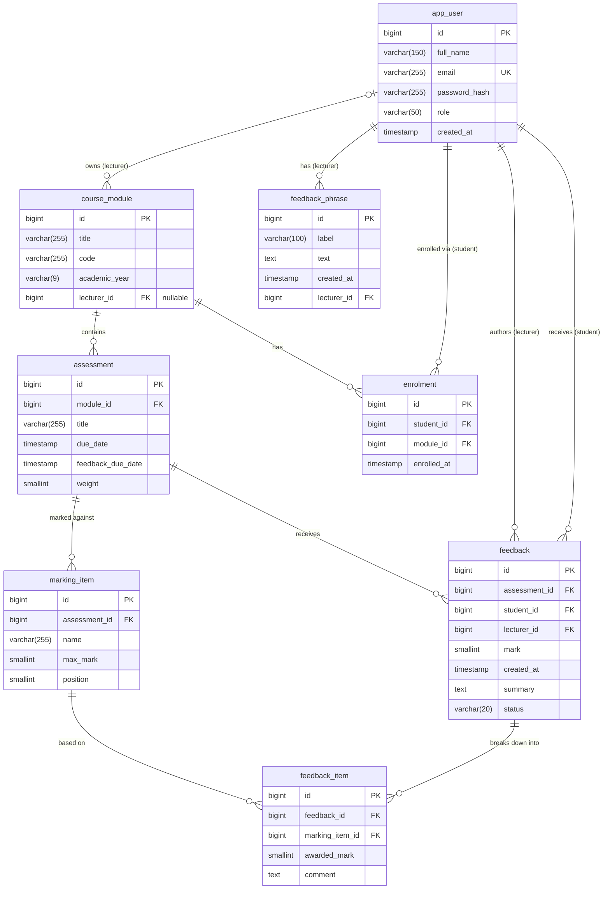
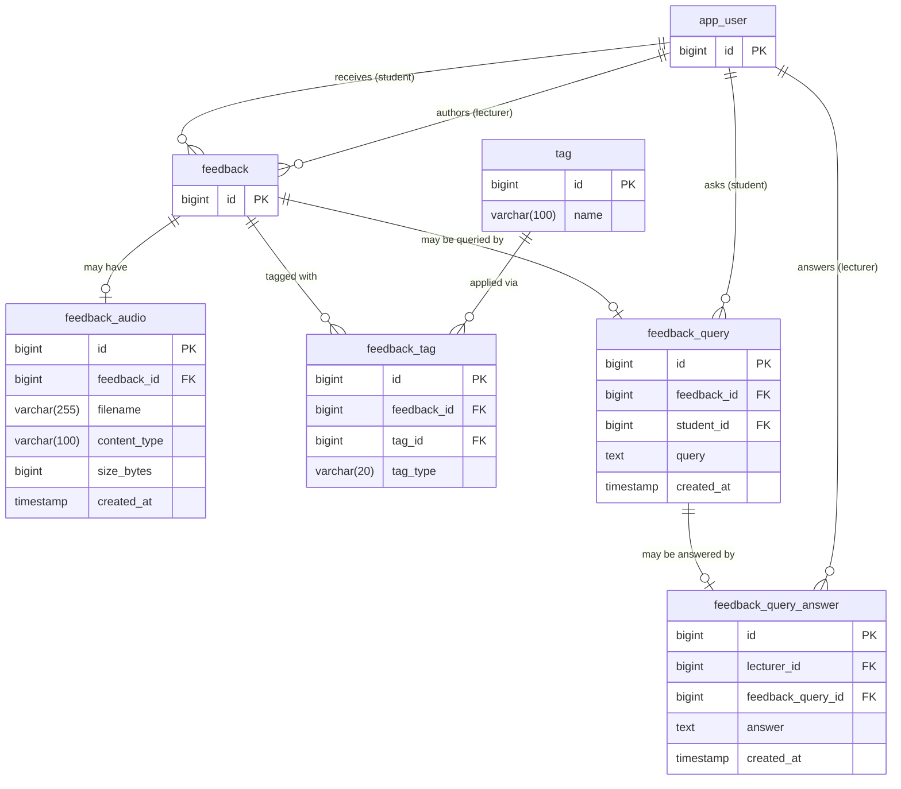

## Assessment Feedback Application

## API Documentation

Interactive documentation is generated from the code and available while the
application is running:

- **Swagger UI** — http://localhost:8080/swagger-ui/index.html
- **OpenAPI spec** — http://localhost:8080/v3/api-docs

To call protected endpoints from the UI, first `POST /api/auth/login` with
`{"email": "lecturer@dissertation.com", "password": "password123"}`, then paste
the returned token into the **Authorize** dialog. This allows endpoints to be called
as the lecturer role.

### Endpoint overview

| Area | Endpoints | Access |
|---|---|---|
| Auth | `POST /api/auth/login` | Public |
| Users | `GET/POST /api/users` | Collection: admin · Individual: authenticated |
| Enrolments | `/api/enrolments`, `/api/students/{studentId}/modules` | Write: admin · Read: authenticated |
| Modules | `GET /api/modules`, `POST /api/modules` | Read: authenticated · Write: admin |
| Assessments | `GET /api/assessments`, `/api/assessments/{id}`, `/api/assessments/stats` | Scoped by role |
| Marking scheme | `/api/assessments/{id}/marking-items` | Owning lecturer |
| Feedback | `POST /api/feedback`, `GET /api/feedback/{id}` | Lecturer writes · student reads own |
| Audio | `/api/feedback/{id}/audio` | Owning lecturer · recipient student |
| Queries | `/api/students/{studentId}/feedback-queries`, `/api/lecturer/feedback-queries`, `/api/feedback-queries/{id}/answer` | Student asks · lecturer answers |
| Tags | `GET /api/tags`, `/api/students/{id}/tag-summary`, `/api/lecturer/tag-summary`, `/api/students/{id}/tag-summary/per-year` | Vocabulary: authenticated · Summaries: own data only |
| Phrases | `/api/phrases` | Lecturer (own only) |

## Entity Relationship Diagrams

Two entity relationship diagrams have been made using Mermaid Live Editor. The first one shows the overall schema and the second shows the omitted extensions of the feedback entity (split up to improve readability).

