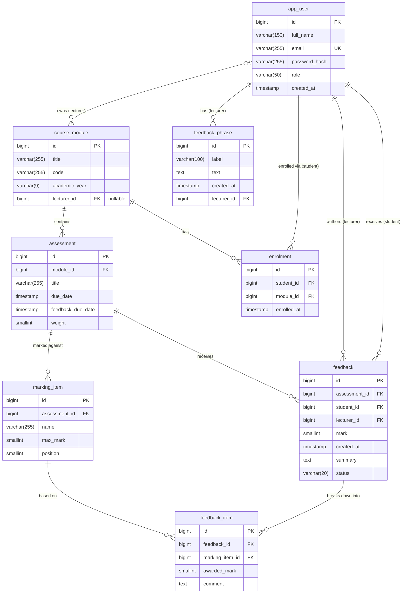

## Assessment Feedback Application

```mermaid
erDiagram
    app_user |o--o{ course_module : "owns (lecturer)"
    feedback ||--o{ feedback_item : "breaks down into"
    marking_item ||--o{ feedback_item : "based on"
    app_user ||--o{ feedback : "receives (student)"
    app_user ||--o{ feedback : "authors (lecturer)"
    assessment ||--o{ feedback : "receives"
    assessment ||--o{ marking_item : "marked against"
    course_module ||--o{ assessment : "contains"
    app_user ||--o{ enrolment : "enrolled via (student)"
    course_module ||--o{ enrolment : has
    app_user ||--o{ feedback_phrase : "has (lecturer)"
    app_user {
        bigint id PK
        varchar(150) full_name
        varchar(255) email UK
        varchar(255) password_hash
        varchar(50) role
        timestamp created_at
    }
    course_module {
        bigint id PK
        varchar(255) title
        varchar(255) code 
        varchar(9) academic_year
        bigint lecturer_id FK "nullable"
    }
    feedback_phrase {
        bigint id PK
        varchar(100) label
        text text
        timestamp created_at
        bigint lecturer_id FK
    }
    enrolment {
        bigint id PK
        bigint student_id FK
        bigint module_id FK
        timestamp enrolled_at
    }
    assessment {
        bigint id PK
        bigint module_id FK
        varchar(255) title
        timestamp due_date
        timestamp feedback_due_date
        smallint weight
    }
    marking_item {
        bigint id PK
        bigint assessment_id FK
        varchar(255) name 
        smallint max_mark
        smallint position
    }
    feedback {
        bigint id PK
        bigint assessment_id FK
        bigint student_id FK
        bigint lecturer_id FK
        smallint mark
        timestamp created_at
        text summary
        varchar(20) status
    }
    feedback_item {
        bigint id PK
        bigint feedback_id FK
        bigint marking_item_id FK
        smallint awarded_mark
        text comment
    }
```
